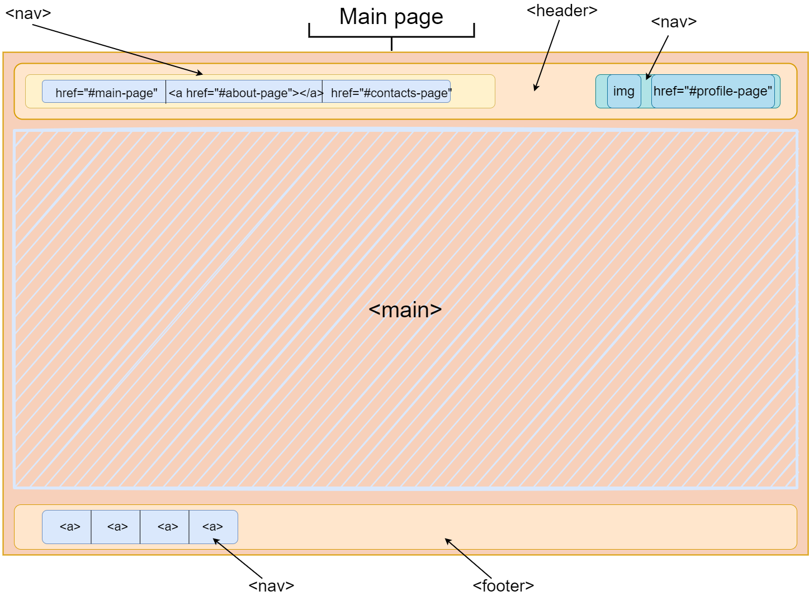
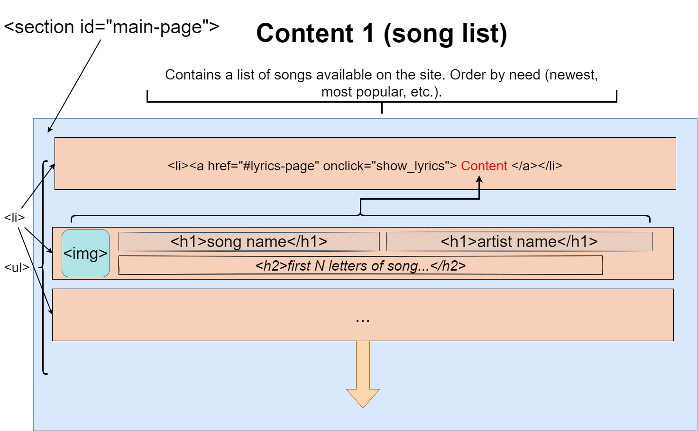
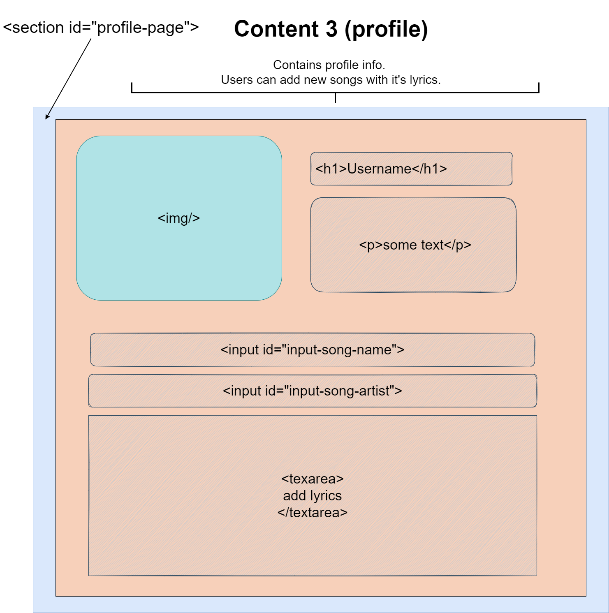
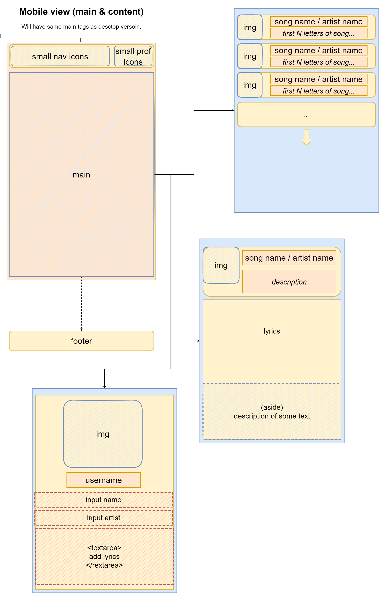

## Dubrovskiy Konstantin 953502

### Song and lyrics DB
___

An application to store and discuss song lyrics.

__Basic functions:__
* Music tracks (CRUD)
  + title
  + album
  + author
* Lyrics (CRUD)
  + each song can have one or more lyrics
  + author
  + language (original or translation)
  + user can select (with mouse or touch) a part of the text and add an
annotation to it
  + text parts with annotations should be highlighted in text, annotations are
displayed near the text
  + other users can rate lyrics and comments (upvote / downvote)

__Examples__: _[Genius](https://genius.com/)_

### UX outline
___

_Main page:_

_Song list:_

_Song lyrix:_

_Profile page:_

_Mobile view:_
